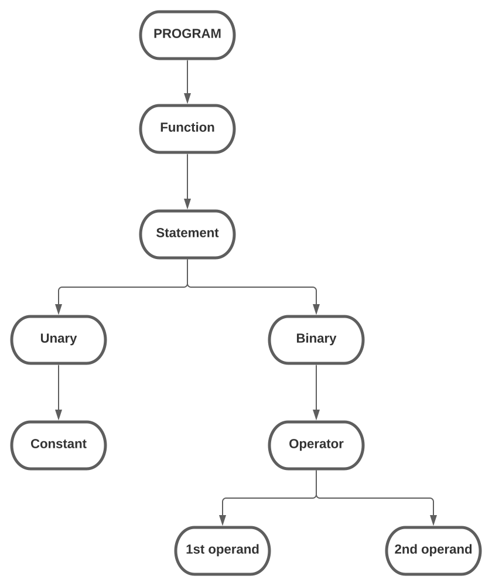
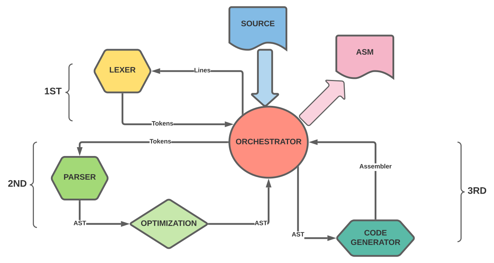

# **C201-Hadoken**
# Elixir C compiler (ECC)

This work it's based on the Nora's Sandler schedule and
tutorials for constructing a C language subset compiler.
[Nora Sandler](https://norasandler.com/)

## Prerequisites:
- Elixir version >=1.9
- Unix/POSIX system
  
**In order to use this program:**
>git clone to this repository 
> 
> mix compile
> 
> mix script.build
> 
> run as ./ecc -h to help

## Expansion Three for our compiler

## Architecture of the compiler

Documentation available in [Documentation](DOCUMENTATION.md)

For new contributions see [Contributing](CONTRIBUTING.md)

For naming convention see [Naming Conventions](CONVENTIONS.md)

LICENSED UNDER BSD 2-Clause License
